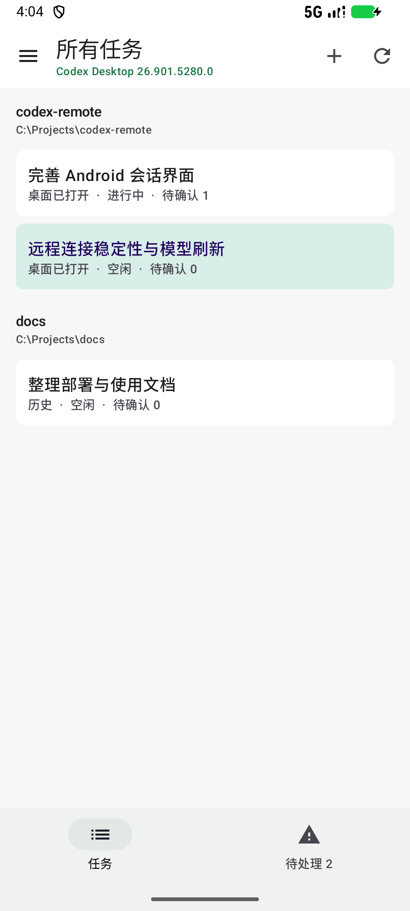
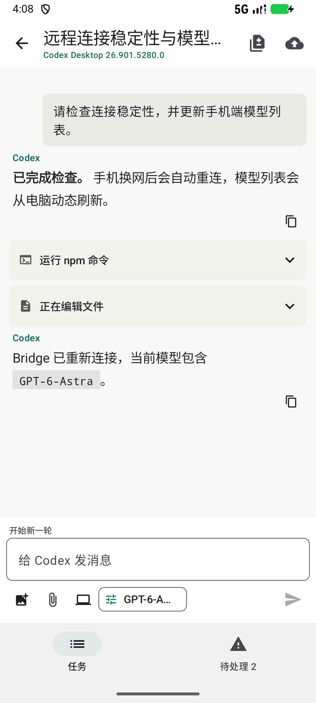
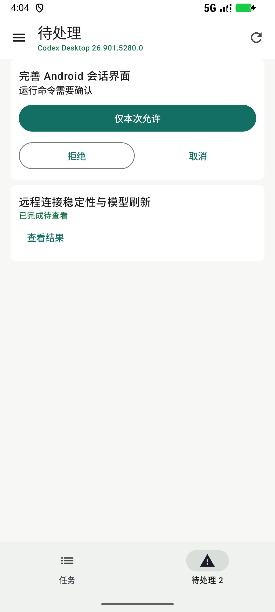
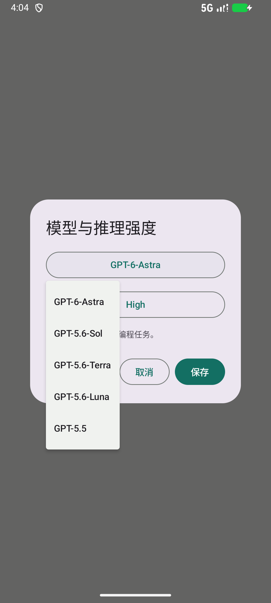
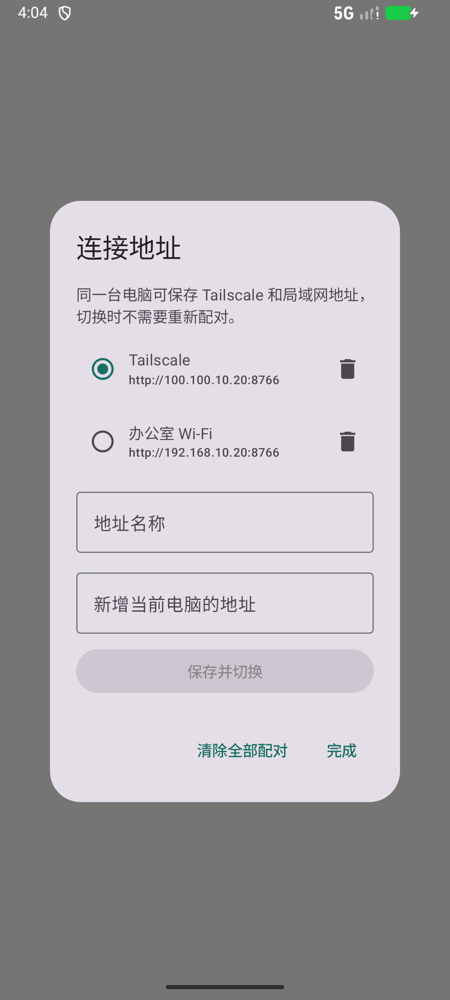
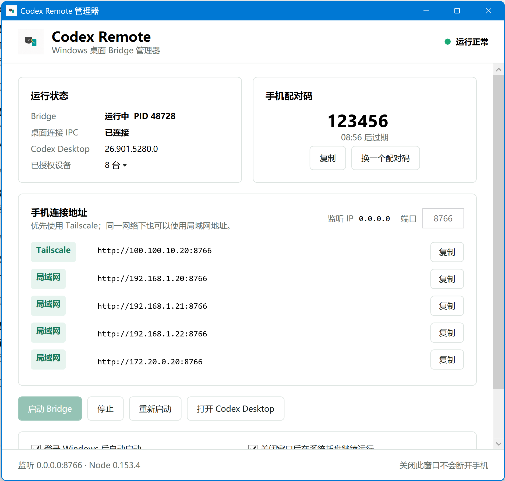

# Codex Desktop Remote for Android

这是一个适用于 Windows ChatGPT/Codex Desktop 的 Android 远程控制器。

> 本项目与 OpenAI 无关联，也不是官方产品。它依赖 Codex Desktop 的私有本地 IPC；桌面版升级后可能需要更新协议适配。

## 界面预览

| 任务列表 | 连续对话与折叠详情 | 待处理 |
| --- | --- | --- |
|  |  |  |

| 动态模型列表 | 多连接地址 |
| --- | --- |
|  |  |

### Windows 管理器



截图中的配对码和连接 IP 均为演示数据。管理器会显示实际 IP、端口和连接地址，并可展开“已授权设备”删除不再使用的设备。

## 一、准备工作

电脑需要：

- Windows 11
- 已安装并登录 Codex Desktop
- Tailscale（远程使用时需要）

手机需要：

- Android 8.0 或更新版本
- 与电脑登录同一个 Tailscale 账号或 tailnet

## 二、启动电脑端

下载 GitHub Releases 中最新的 Windows 压缩包并解压，然后双击：

```text
CodexRemoteManager.exe
```

管理器会自动启动 Bridge，并直接显示：

- Bridge、桌面 IPC 和 Codex Desktop 版本状态
- 六位临时配对码与剩余有效时间
- 监听 IP、端口、Tailscale 地址和局域网地址
- 启动、停止、重启和打开 Codex Desktop
- 登录 Windows 后自启动

关闭管理器窗口后默认缩到系统托盘，Bridge 会继续运行，手机不会断开。现有脚本仍保留给开发和故障排查使用，普通使用不再需要 PowerShell、CMD 或单独安装 Node.js。

## 三、安装手机 App

把下面的 APK 发送到手机并安装：

```text
android\app\build\outputs\apk\debug\app-debug.apk
```

Android 如果提示“禁止安装未知应用”，请临时允许当前文件管理器安装 APK。

## 四、使用 Tailscale 配对

1. 确认电脑和手机的 Tailscale 都显示在线。
2. 在 Windows 管理器中找到标记为 `Tailscale` 的连接地址并点击复制。
3. 管理器会同时显示当前 IP、端口和完整 URL。
4. 打开手机上的 Codex Remote，电脑地址填写：

   ```text
   http://<电脑的 Tailscale IP>:8766
   ```

5. 输入 Bridge 窗口显示的六位配对码，然后点击“连接”。
6. 允许通知权限，以便在后台收到审批提醒。

六位配对码是临时随机码，有效期为 10 分钟，并不是固定密码。配对成功后手机会保存自己的加密令牌，日常使用不需要重复输入配对码。

同一台电脑可以同时保存多个访问地址。首次配对时可自己填写连接名称；之后在左侧菜单打开“连接地址”，为 Tailscale 地址和局域网地址分别填写任意名称与 URL。这些地址共用当前电脑的配对令牌，之后点选即可切换，不需要再次输入六位码。

## 五、日常使用

1. 在电脑上打开 Codex Desktop，并打开需要控制的任务。
2. 双击 `launch-codex-remote.cmd`。
3. 打开手机 App，进入对应项目和任务。
4. 在底部输入框发送消息，或使用手机输入法的语音按钮。

主要功能：

- 查看项目和任务列表
- 在“待处理”中查看权限审批和已完成待查看的任务
- 保存并切换同一台电脑的多个 Tailscale/局域网地址
- 查看 Codex 实时回复和电脑端生成的图片
- 下载并打开回复中明确引用的电脑文件
- “正在编辑文件”默认折叠，按需展开文件列表
- 开始新一轮、补充当前轮次或排队消息
- 停止正在运行的任务
- 处理命令、文件和权限审批
- 切换模型与推理强度
- 查看完整 Diff
- 创建新任务
- 从手机或当前任务的电脑工作目录添加图片和文件附件
- 请求 Codex 检查、提交并推送代码

只有电脑当前打开并拥有 owner 的任务可以远程发送和审批。历史任务仍可查看，但需要先在 Codex Desktop 打开，才能继续操作。

模型列表从电脑动态读取。打开“模型与推理强度”或新建任务窗口时会重新查询；桌面新增模型后无需修改 App 内置列表。模型和支持的推理强度以当前账号的电脑端返回结果为准。

## 六、自动更新与自启动

- 在 Android App 左侧菜单点击“检查更新”，App 会从本项目 GitHub Releases 对比版本并下载新版 APK。
- 发现新版本时也会自动提示；APK 下载完成后由 Android 系统安装器确认更新。
- Windows 管理器中勾选“登录 Windows 后自动启动”即可启用自启动，不需要管理员权限。

## 常见问题

### 手机连接不上

- 打开 Windows 管理器，确认顶部显示“运行正常”。
- 确认电脑和手机的 Tailscale 都在线。
- 确认地址带有 `http://` 和端口 `:8766`。
- 不要配置路由器公网端口映射。
- 检查 Windows 防火墙是否允许 `8766/TCP`。

手机换网或连接中断后会自动重连。Bridge 会重建超时的桌面 IPC 连接并恢复任务订阅，辅助任务目录进程失败后也会重新启动。如果本机服务没有响应，重新双击 `launch-codex-remote.cmd` 可恢复本项目 Bridge，已有配对不受影响。

### 显示 `request-timestamp-out-of-range`

打开手机的“自动设置日期和时间”。Bridge 为防止请求重放，只接受电脑时间前后 60 秒内的请求。

### 任务显示“历史记录”

先回到电脑，在 Codex Desktop 中打开这个任务。手机会自动重新 follow 当前任务。

## 安全说明

- 只在可信局域网或同一 Tailscale tailnet 中使用。
- 不要把 `8766` 端口映射到公网。
- 普通公网 IP 和域名会被 Android 客户端拒绝。
- 每台手机使用独立令牌，请不要复制 Bridge 的设备数据目录。
- 涉及密码等秘密输入时，请回到电脑端处理。

## 许可证

项目代码按 [MIT License](./LICENSE) 开源。

更详细的开发和协议说明：

- [Android 说明](./android/README.md)
- [Bridge 说明](./desktop_bridge/README.md)
- [Bridge API](./desktop_bridge/API_CONTRACT.md)
- [Windows 管理器说明](./windows_launcher/WINDOWS_README.txt)

## 当前验证状态

- Bridge：91 项测试通过
- Android：单元测试、APK 构建通过
- Compose 模拟器：11 项交互测试通过（包括图片显示与大图内存限制、电脑文件选择、多地址存储和输入法间距回归）
- Tailscale：配对、任务加载、实时会话和 Bridge 冷重启恢复均已验证
